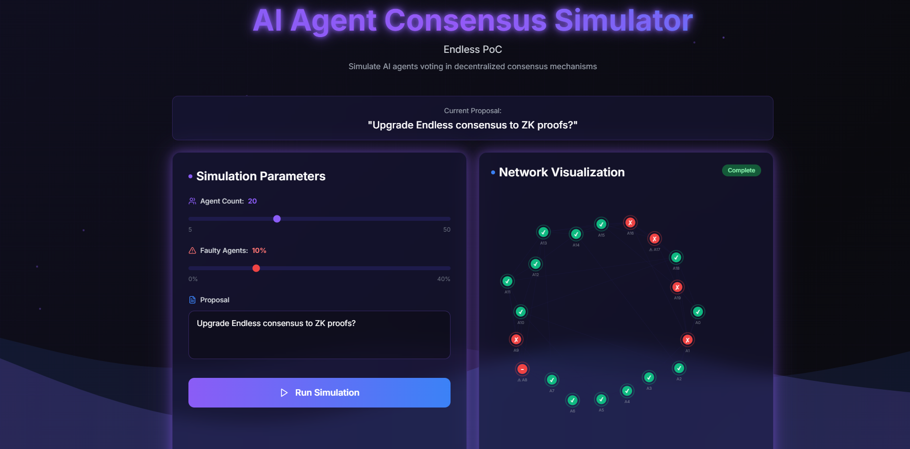

# AI Agent Consensus Simulator – Endless PoC

A proof-of-concept interactive web simulator demonstrating how AI agents can participate in feature-based consensus mechanisms within the Endless decentralized cloud.

**Live Demo:** https://ai-agent-consensus-simulator.vercel.app/



## What It Does
This tool allows users to simulate a decentralized consensus process with AI agents:
- Configure parameters: Number of agents, % faulty agents, proposal text
- Run simulation: Agents vote (Yes/No) based on mock AI logic
- Visualize: Animated network graph (nodes = agents, lines = communication), progress bar, final outcome (Agreed / Failed / Partial)
- Effects: Wave particles on success, Nessy mascot flying in for protection

All interactions highlight privacy: Agent votes protected by DID + E2EE + decentralized relays – no data leakage.

## Why It Matters to the Endless Ecosystem
- **Showcases AI agent integration**: Demonstrates how agents can enhance consensus in Endless's decentralized cloud – a step toward AI-powered governance.
- **Privacy-first simulation**: Aligns with Endless core values (E2EE, DID, relays) – agents vote without exposing data.
- **Educational & experimental tool**: Helps devs understand & test consensus mechanisms (Block-STM, feature-based, ZK proofs) in a visual, interactive way.
- **Scalable innovation**: Can evolve into real on-chain agent consensus experiments, boosting ecosystem robustness & developer experimentation.
- **Community engagement**: Fun simulation encourages more builders to explore Endless's modular components & AI tooling.

## Features (MVP)
- Configurable simulation parameters (agents count, fault %, proposal)
- Animated D3.js/SVG network graph (nodes move slightly, vote colors: green honest / red faulty)
- Step-by-step progress with wave effects & Nessy cameo on success
- Responsive dark-mode UI (Endless aesthetic: purple-black-blue-white)
- Pure React + Tailwind + Framer Motion – easy to extend

## How to Run / Test
1. Clone the repo:
   ```bash
   git clone https://github.com/duchth1993/ai-agent-consensus-simulator.git
